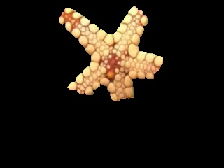

# saliency-from-backproj
Saliency map generated by back projecting the image histogram on itself, and refinement with Grabcut.




Usage:
```Python

img = cv2.imread(sys.argv[1], 1)
img = cv2.resize(img, (640/2, 480/2))
mask = backprojection_saliency(img)
segmentation = img*mask[:,:,np.newaxis]
```
