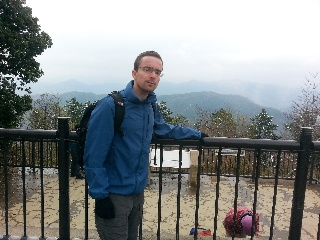
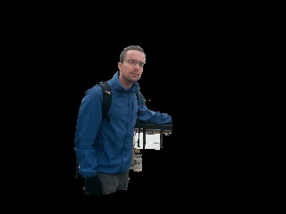

# saliency-from-backproj
Saliency map generated by back projecting the image histogram on itself, and refinement with Grabcut.





Usage example:
```Python

img = cv2.imread(image.jpg, 1)
img = cv2.resize(img, (640/2, 480/2))
mask = backprojection_saliency(img)
segmentation = img*mask[:,:,np.newaxis]
```

[For more details refer here.](http://jacobcv.blogspot.com/2015/04/simple-image-saliency-detection-from.html)
